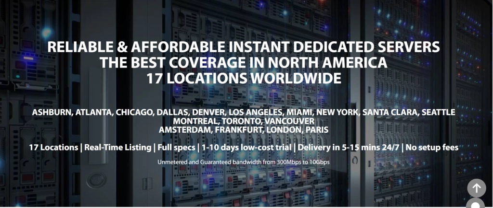
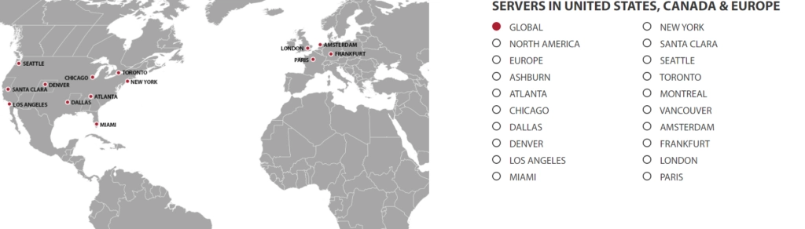
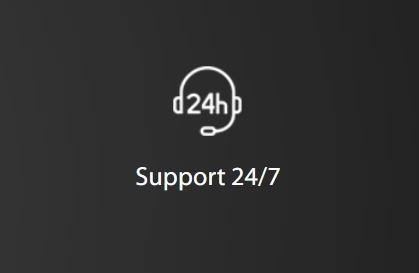
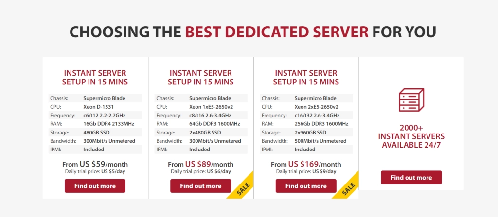

# GTHost Review: A Global Hosting Solution for Worldwide Reach

---

Running a business with customers scattered across continents? Tired of watching your site crawl for users halfway around the world? Here's something that might help.

GTHost is a hosting platform that gives you actual server locations where your customers are—not just promises about "global reach." Founded in 2012, they've built out 17+ data center locations worldwide. This means you can pick a server in Singapore for your Asian customers, or Frankfurt for your European ones. Simple, practical, and it actually works. If you're looking for **dedicated server hosting with real global coverage**, this could be worth a look.

---

So here's the deal with GTHost (GLOBALTELEHOST Corporation, if you want the official name). They started in 2012 with a straightforward goal: provide **reliable hosting services** without the usual runaround. No fancy marketing speak—just servers in places you actually need them.

## Where Their Servers Actually Are

One thing I appreciate: you can actually see where their data centers are. Not just "North America" or "Asia-Pacific"—actual cities. This matters because your server's physical location directly impacts how fast your site loads for visitors in that region. 

You build your plan based on what you need. Storage capacity, location, specifications—it's all customizable. No being stuck with a package that includes stuff you'll never use.

## Security That's Actually There

Look, your data matters. Years of work, customer information, your entire online presence—it's all sitting on these servers. GTHost handles this with:

- **DDoS protection** that actually blocks attacks (not just claims to)
- SSL encryption included
- Zero tolerance policy for using their servers to attack others

They encrypt your data with SSL software, which is table stakes these days but worth confirming. 👉 [See how GTHost's security measures protect your dedicated servers](https://cp.gthost.com/en/join/72c7e6b2fc118929f9ede2978f008806)

## Getting Help When Things Go Sideways

New hosting provider means learning curve. That's just reality. GTHost offers 24/7 support through calls, chat, or email. They have specific addresses for different issue types—billing goes one place, technical stuff goes another. Organized, at least.

During odd hours or urgent situations, having real support available matters more than you think.

## What Makes GTHost Different

### Unlimited Bandwidth

Here's where things get interesting. No bandwidth caps. No surprise charges when you exceed some hidden limit. Your site takes off and traffic spikes? Great—that won't cost extra. This is huge for growing businesses or seasonal traffic patterns.

### Fast Setup Time

They claim 5-15 minutes from purchase to working server. I know, sounds optimistic. But even if it takes an hour, that beats waiting days for provisioning. You can start working almost immediately instead of sitting around waiting for access.

### Full Root Access

Your server, your rules. You get complete root access, meaning you control everything. Want to install custom software? Go ahead. Need to tweak configurations? Do it. No waiting for support tickets to make basic changes.

## The Dedicated Server Option

GTHost focuses primarily on **dedicated servers**. You customize your plan based on storage needs and location. Pricing starts at $59/month, but that's just the baseline—your actual cost depends on what you build.

This flexibility works well if you know what you need. If you're just starting out and want something simple, the customization might feel overwhelming. But for businesses with specific requirements? Perfect.

## Do We Actually Recommend This?

Yeah, we do. Especially if you need **dedicated server hosting with specific location requirements**. The range of server locations solves real problems for global businesses. The ability to customize your plan means you're not paying for features you don't need.

Is it perfect? No. The trial period terms could be clearer (they offer 1-10 days at reduced cost, not fully free). But the core service—reliable dedicated servers in multiple locations—delivers.

## Common Questions

**Does GTHost offer a free trial?**
Not exactly free. They offer 1-10 day trials at reduced cost. Check their [terms of service](https://cp.gthost.com/en/page/terms?_ga=2.179979619.656792361.1655286311-1729963139.1655286311) for specifics.

**What does GTHost cost?**
Starts at $59/month, but you're building a custom plan. Final price depends on your chosen features and specifications.

**How do you get support?**
Live chat, phone calls, or email. They provide specific email addresses for billing vs. technical issues. Available 24/7.

**Are these actually dedicated servers?**
Yes. Most of GTHost's offerings are dedicated servers. You pick your location and storage capacity, starting at $59/month.

---

## Final Thoughts

So that's GTHost. About 17 global locations, unlimited bandwidth, DDoS protection, SSL included. The widespread server locations matter for site speed—closer servers mean faster loading times.

The unlimited bandwidth means your site handles traffic spikes without choking or costing extra. The security features (DDoS protection and SSL) give you peace of mind about data safety.

Could they explain the trial period better? Sure. But if you need **dedicated server hosting with actual global presence**, GTHost delivers on the fundamentals. They've figured out what matters: location, speed, security, and support when things break. 👉 [Explore GTHost's dedicated server options for your global business needs](https://cp.gthost.com/en/join/72c7e6b2fc118929f9ede2978f008806)
